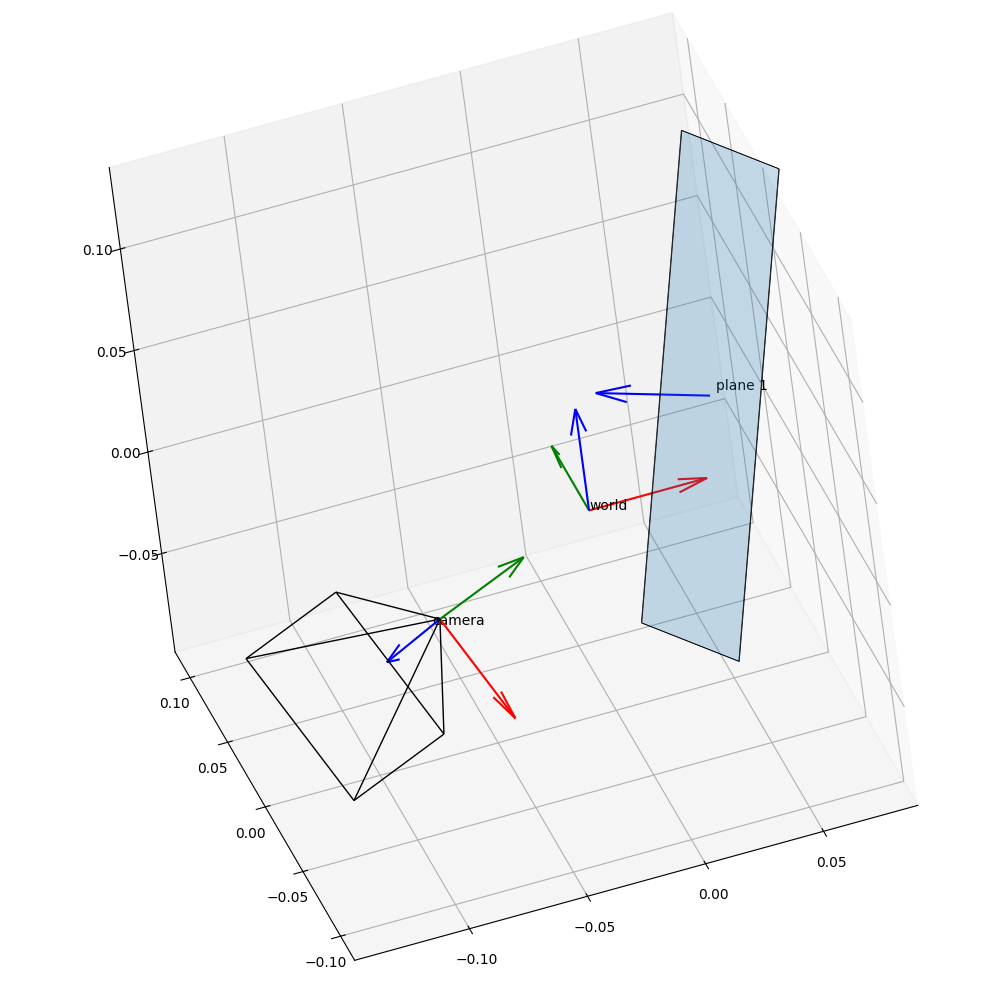

# plotgeom
A lightweight Python library for visualizing camera poses, fields of view, coordinate axes, and geometric primitives in 3D using Matplotlib.




## Installation
```
pip install git+https://github.com/cheind/plotgeom.git
```

## Usage

This script renders the teaser image above. 

```python
import numpy as np
import matplotlib.pyplot as plt

# Main import
import plotgeom as pg

np.random.seed(112)

# Create figure
fig = plt.figure(figsize=(10, 10))

# Helper to create 3d axis
ax = pg.make_ax(fig, proj="persp")

# Plot world axes
pg.plot_axes(ax, rt=np.eye(4), scale=0.05, name="world")

# Plot a plane with limits
pg.plot_plane(
    ax,
    pg.random_pose(),
    extent_xy=(0.2, 0.1),
    name="a plane",
    draw_normal=True,
    scale=0.05,
)

# Random camera setup
pose = pg.random_pose()
K = np.array([[800, 0, 320], [0, 800, 240], [0, 0, 1]])
shape = (480, 640)
hfov, vfov = pg.fov_from_K(K, shape)
image = pg.generate_chessboard_image((8, 6), square_size=80)
image[:80, :80] = (0, 1, 1)

# Plot camera field of view
pg.plot_camera_fov(ax, pose, hfov, vfov, scale=0.1)
# Add an image to far plane
pg.plot_camera_image(ax, pose, image, hfov, vfov, scale=0.1, tex_res=(32, 32))
# Add camera origin
pg.plot_axes(ax, pose, scale=0.05, name="a camera")

# Ensure equal aspect and do some minor axes styling
pg.set_axes_equal(ax)
pg.style_ax(ax)

# Show
plt.show()
```

